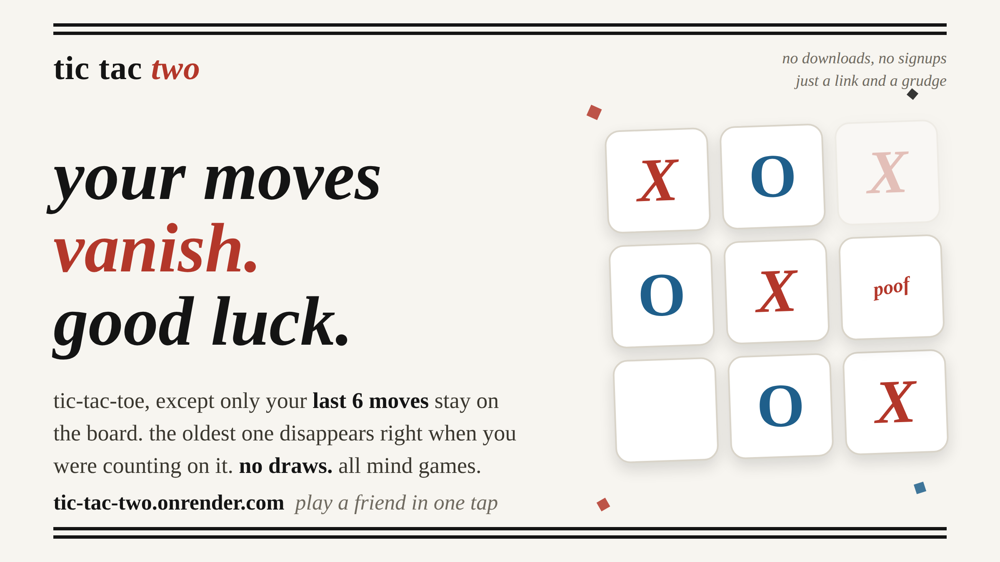

# Tic-Tac-Two

[](https://tic-tac-two.onrender.com)

Tic-tac-toe was solved 40 years ago, so we broke it: only your **last 6 moves** stay on the board, and the oldest one vanishes right when you were counting on it. No draws. All mind games.

## 🕹️ Play Now

Try the game live at: [tic-tac-two.onrender.com](https://tic-tac-two.onrender.com). No downloads, no signups, just a link and a grudge: play a friend in one tap.

## 🚀 Features

- **Modern Rules:** Experience new mechanics: only the last 6 moves remain on the board, creating unique strategies beyond classic Tic-Tac-Toe.
- **Multiplayer:** Play against another person locally, with automatic player symbol assignment.
- **Dynamic Gameplay:** As older moves disappear, plan ahead for a moving target!
- **Simple, Responsive UI:** Clean design, works great on desktop and mobile.
- **Open Source:** All code is available here, contributions and ideas are welcome!

## 💡 What Makes It Unique?

- **Move History Constraint:** Only the 6 most recent moves are visible on the board. Older moves vanish, making each game unpredictable and requiring new tactics.
- **Session-based Player Assignment:** Each player is assigned X or O per session, ensuring fairness.
- **Modern Stack:** Java backend with a React-based frontend.

## 🛠️ Contributing

We welcome contributions of all kinds! You can help by:
- Enhancing or tweaking game mechanics
- Improving the interface and user experience
- Fixing bugs or adding tests
- Expanding documentation

**Note:**  
The app is deployed on Render. For security and privacy, deployment credentials or access to the Render account will NOT be shared.  
You are encouraged to fork this repository, run it locally, and submit pull requests. All proposed changes to the game logic, frontend, or backend are welcome!

### Getting Started Locally

1. **Clone the repo:**
    ```sh
    git clone https://github.com/athrvk/tic-tac-two.git
    cd tic-tac-two
    ```

2. **Backend (Java/Spring Boot):**
    - Navigate to `backend/` and follow standard Spring Boot setup to run the server.

3. **Frontend (React):**
    - Navigate to `frontend/` and run:
      ```sh
      npm install
      npm start
      ```

4. The app will be available at the default port (usually `localhost:3000` for frontend).

## 📄 License

This project is open source, licensed under the MIT License.  
See [LICENSE](LICENSE) for details.

---

Enjoy the game, and happy hacking!
